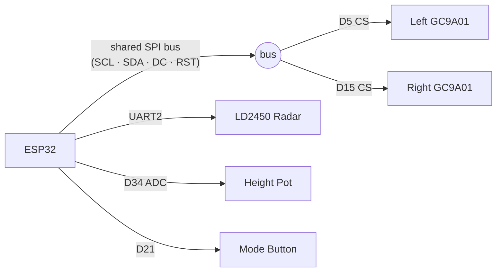

# EyeN

ESP32 digital eyes: dual GC9A01 round LCDs track people via a single HLK-LD2450 radar. Horizontal gaze comes from target azimuth; vertical gaze is estimated from range plus a potentiometer that dials in mount height (eye-level vs floor, etc.).

**Board:** ELEGOO ESP32-WROOM-32

Silk labels:  
`VIN GND D13 D12 D14 D27 D26 D25 D33 D32 D35 D34 VN VP EN 3V3` ·  
`GND D15 D2 D4 RX2 TX2 D5 D18 D19 D21 RX0 TX0 D22 D23`

## Wiring

Working prototype pinout (matches `components/config/include/config.h`). Common **GND**. Displays → **3V3**. Radar → **VIN** (~5V when USB-powered).

### Net diagram

```
                    ┌─────────────────────────────────────────┐
                    │         ELEGOO ESP32-WROOM-32           │
   3V3 ─────────────┤ 3V3                                     │
   GND ─────────────┤ GND                                     │
   VIN ─────────────┤ VIN  (~5V from USB)                     │
   LCD SCL ─────────┤ D18                                     │
   LCD SDA ─────────┤ D23                                     │
   LCD DC  ─────────┤ D4                                      │
   LCD RST ─────────┤ D27                                     │
   LCD CS L ────────┤ D5                                      │
   LCD CS R ────────┤ D15                                     │
   Radar TX→ESP ────┤ RX2 (GPIO16)                            │
   ESP→Radar RX ────┤ TX2 (GPIO17)                            │
   Pot wiper ───────┤ D34                                     │
   Button ──────────┤ D21 (other leg → GND)                   │
                    └─────────────────────────────────────────┘
```



### GC9A01 (both eyes — shared SPI, 7-pin)

| Display | ESP32 silk |
|---------|------------|
| VCC | **3V3** |
| GND | **GND** |
| SCL | **D18** |
| SDA | **D23** |
| DC | **D4** |
| CS left / right | **D5** / **D15** |
| RST | **D27** (shared) |

Only **CS** differs per eye; SCL/SDA/DC/RST are bused. Panel rotation is set in `config.h` (`CFG_LCD_LEFT_ROTATION_DEG` / `CFG_LCD_RIGHT_ROTATION_DEG`). Default is 90° / 270° for outward-facing flex cables. Use 0 / 180 / 90 / 270.

### LD2450 (single sensor)

| Signal | ESP32 silk |
|--------|------------|
| Sensor TX → ESP | **RX2** (GPIO 16) |
| ESP → Sensor RX | **TX2** (GPIO 17) |

VCC→**VIN**, GND→**GND**. Mount flat (~0° pitch). Copper face toward the walkway with **4 pads bottom / 2 pads top** so left/right (`x`) tracks correctly.

You can solder to the module pads instead of the 4-pin plug. Use **5V, GND, TX, RX** only. Leave **3.3V, PA9, DP, DM** open (programming / USB upgrade). Do not power the radar from the 3.3V pad. UART is 3.3 V TTL; baud **256000** 8N1.

The **TX wiring** (ESP → Sensor RX) is needed for live tuning from the Python tool. Tracking alone can leave TX unconnected. Do **not** use `RX0`/`TX0` (USB serial).

### Mount-height potentiometer

| Pot | ESP32 |
|-----|-------|
| Wiper | **D34** (GPIO 34, ADC1) |
| Ends | **3V3** and **GND** |

Maps ADC → sensor mount height (default 0–2000 mm). Assumed person aim height is ~1500 mm (torso/face). Elevation is `atan2(aim − mount, range)` mapped into pupil Y. Tune the pot for your placement rather than rebuilding.

### Mode button

| Button | ESP32 |
|--------|-------|
| One leg | **D21** (GPIO 21) |
| Other leg | **GND** |

Internal pull-up is enabled in firmware. No external resistor needed. Pressing the button cycles through display modes.

## Display modes

Press the button on **D21** to cycle. Current modes:

1. **Eye** (default) — white background, black pupil tracks the nearest/moving person.
2. **Radar** — green-on-black flight-radar aesthetic:
   - *Left eye:* rotating PPI sweep over a 120° FOV wedge with range rings. Targets light up green when the sweep passes and fade back to black.
   - *Right eye:* monospace data readout of the currently tracked target (X, Y, distance, speed, azimuth).

Adding modes: create a new `components/ui/mode_*.cpp`, implement the `display_mode_t` interface from `components/ui/include/mode.h`, and register it in the `s_modes[]` table in `main/main.cpp`.

## Vertical estimate (single sensor)

Closer targets at a large height delta look steeper; far targets flatten toward center. With the pot at mid-range (sensor ≈ aim height), vertical stays near center at all distances.

## Orientation

Point the module’s **copper-patch face** at the walkway. The plug-in adhesive antenna is **Bluetooth only** — not for tracking.

**Roll (critical for left/right):** copper face toward you with **four pads on the bottom and two on the top**. Do **not** mount “landscape” with pads left/right of each other.

## Build / flash

```bash
source ~/esp/esp-idf/export.sh
cd ~/esp/EyeN
idf.py set-target esp32
idf.py build flash monitor
```

Logs: `$FRAME t=… sensor=count:targets`, `$LOST t=…`, `$MODE <name>`.

## Visualization / live tuning

Replay a log file:
```bash
python3 tools/replay.py log.txt --speed 0        # step with spacebar
```

Live mode with sensor tuning sliders (requires TX pins wired):
```bash
python3 tools/replay.py --live /dev/ttyUSB0
```

Sliders control LD2450 parameters in real time:
- **Sensitivity** (0–9): lower = fewer false positives, reduced range
- **Energy threshold** (100–10000): higher = ignores weak reflections / ghosts
- **Min speed filter** (0–100 cm/s): ignores static targets below threshold
- **Hold time** (0–60 s): how long a target persists after leaving FOV

Settings persist across power cycles on the LD2450.

## Restoring multi-sensor (pitch stack)

The pitch-stacked fusion lives in `components/radar/radar_stack_multi.cpp` but is **not linked** by default.

1. In [`components/radar/CMakeLists.txt`](components/radar/CMakeLists.txt), set `RADAR_SRC` to `radar_stack_multi.cpp`.
2. In [`components/config/include/config.h`](components/config/include/config.h), restore the commented two-row `CFG_SENSORS` (lower ~−20°, upper ~+20° on UART2 + UART1).
3. Rebuild. Vertical then comes from visibility bands again; the potentiometer is unused in that build.

Optional later: third (mid) sensor + 74HC4051 — multi code already has `mux_channel` hooks.
