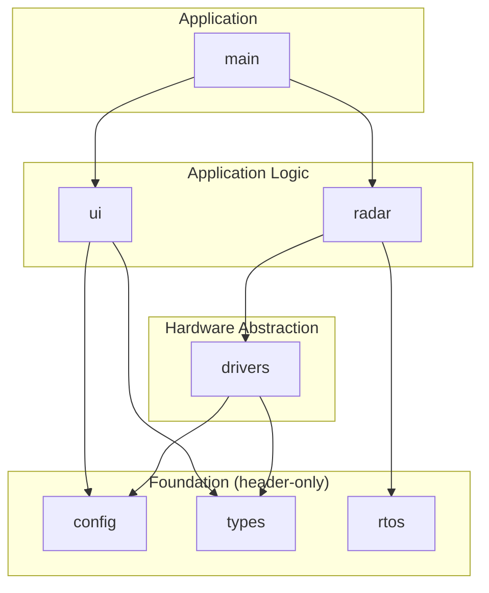
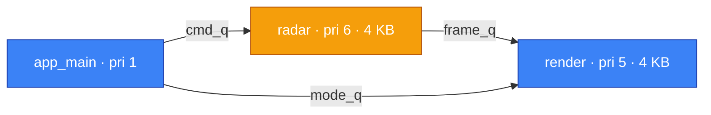
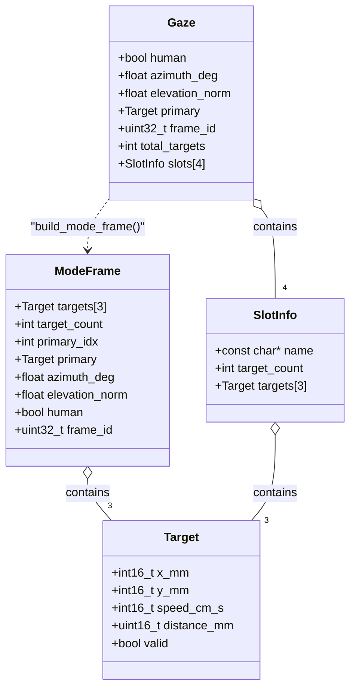
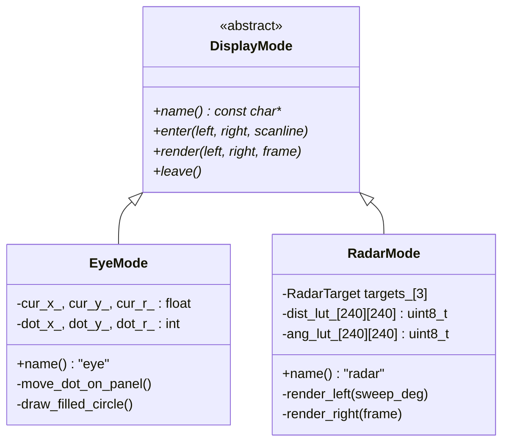
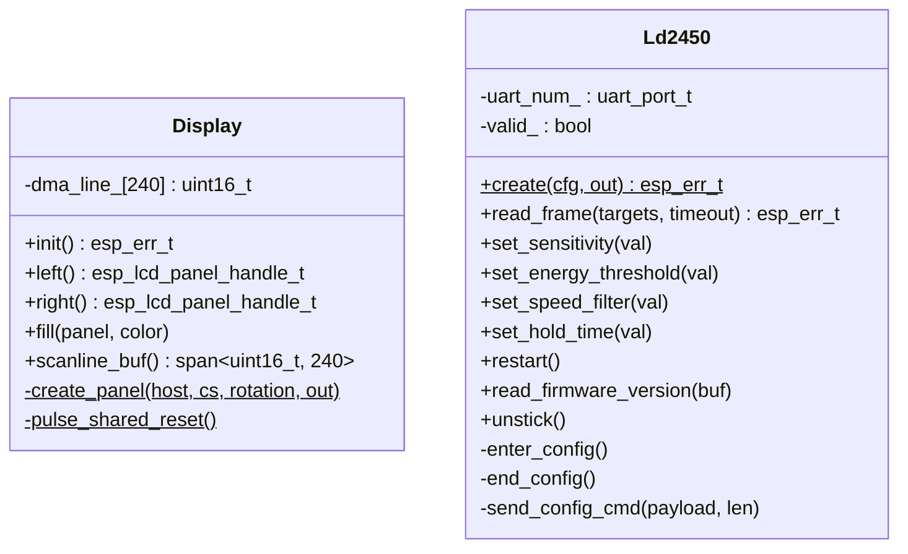
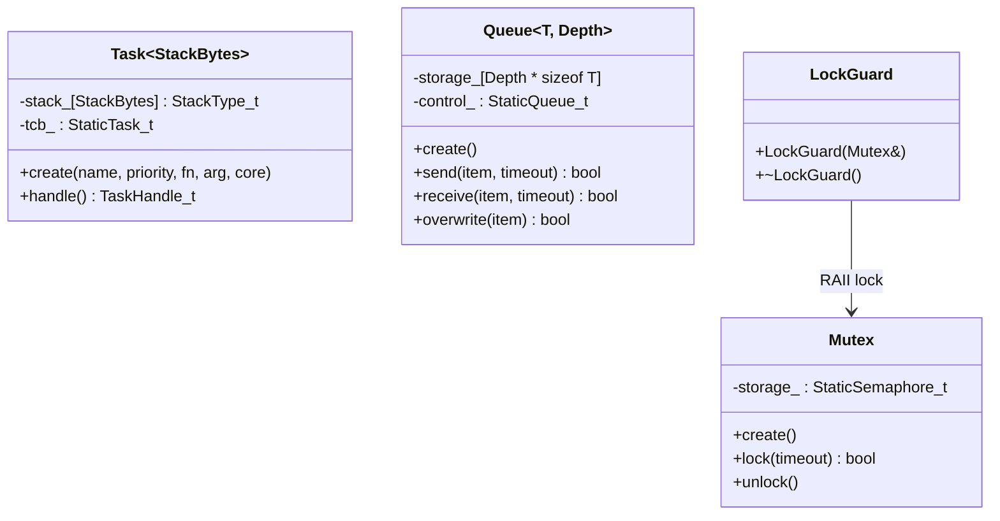
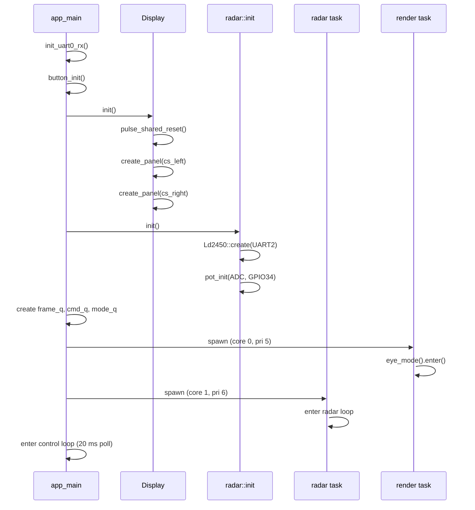
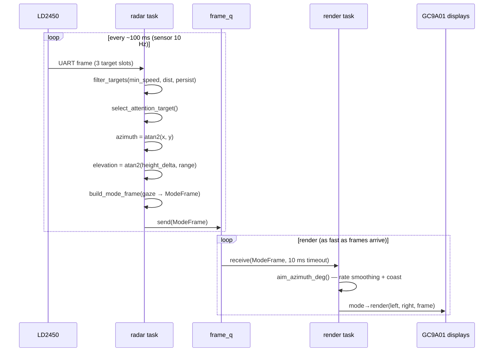
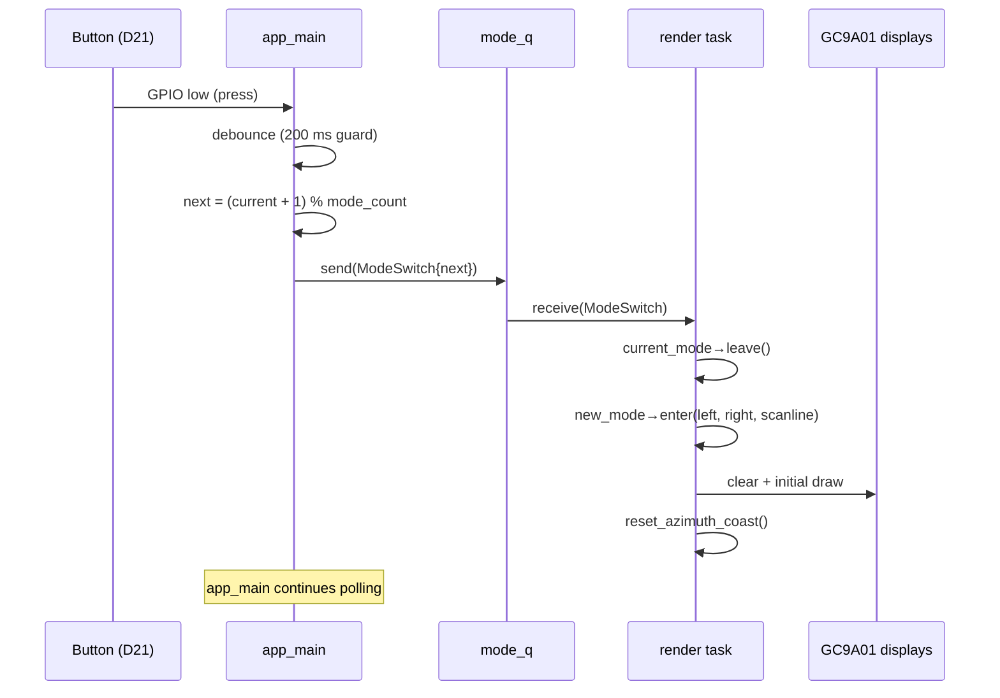
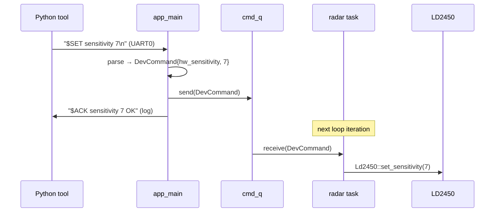

# Software Design

## Layered Architecture

The firmware is organized into four layers. Dependencies flow strictly downward — a component may only depend on components in the same layer or below. This means, for example, the LD2450 UART driver cannot depend on the UI module, and neither `radar` nor `ui` can depend on each other.

| Layer | Component | Responsibility |
|-------|-----------|----------------|
| **Application** | `main` | Entry point: initializes hardware, spawns FreeRTOS tasks, runs the control-plane loop (button polling, UART commands, health logging). Depends on both application-logic components but they do not depend on it. |
| **Application Logic** | `radar` | Sensor reading, target filtering, multi-target attention selection, gaze computation (azimuth + elevation). Owns the sensor read loop. |
| | `ui` | `DisplayMode` interface and concrete renderers (`EyeMode`, `RadarMode`). Pure rendering — no sensor or hardware knowledge. Peer to `radar`; the two cannot depend on each other and communicate only through queues wired by `main`. |
| **Hardware Abstraction** | `drivers` | `Display` (SPI bus + dual GC9A01 panels) and `Ld2450` (UART radar protocol). Hardware I/O only — no processing logic. |
| **Foundation** | `config` | Pin assignments, tuning constants, sensor array definition. Single file to edit for hardware changes. |
| | `types` | `Target`, `ModeFrame`, color constants. Shared vocabulary types with no logic. |
| | `rtos` | `rtos::Task`, `rtos::Queue`, `rtos::Mutex` — C++ wrappers enforcing static allocation of FreeRTOS primitives. Any layer may depend on foundation components. |

## Concurrency Model

Three execution contexts run concurrently. The radar task is pinned to core 1 for uninterrupted UART reads; rendering and the control plane share core 0, separated by priority.

Legend: **blue = core 0**, **amber = core 1**

| Channel | Type | Direction | Purpose |
|---------|------|-----------|---------|
| `frame_q` | `Queue<ModeFrame, 2>` | radar → render | Processed sensor frames with gaze vector |
| `cmd_q` | `Queue<DevCommand, 4>` | app_main → radar | Live tuning commands from UART0 |
| `mode_q` | `Queue<ModeSwitch, 1>` | app_main → render | Display mode change requests |
| `pot_frac` | `std::atomic<float>` | radar → (shared) | Smoothed potentiometer reading (0.0–1.0) |

All FreeRTOS objects use `*Static` creation variants via the `rtos::` wrappers — zero runtime heap allocation.

### Task Details

**radar** (core 1, priority 6) — tight loop: drain `cmd_q`, call `Ld2450::read_frame()` (blocks up to 100 ms on UART), filter targets, select attention target, compute gaze, build `ModeFrame`, send to `frame_q`. Logs frames at 1 Hz.

**render** (core 0, priority 5) — loop: check `mode_q` for mode switches, receive from `frame_q` (10 ms timeout), apply azimuth coasting, call `DisplayMode::render()`. When no frame is available, the loop spins on `frame_q` to stay responsive.

**app_main** (core 0, priority 1) — 20 ms poll loop: reads UART0 for `$SET` commands, polls the button with debounce, emits `$HEALTH` logs every 60 s (heap, stack high-water marks).

## Data Types

`Target` is the raw per-target output from the LD2450: position, speed, and a validity flag. The radar component produces a `Gaze` internally (carrying slot-level detail for multi-sensor support), then converts it to a `ModeFrame` — the simplified struct that crosses the queue to the render task.

## Display Mode Interface

Modes are singletons returned by factory functions (`eye_mode()`, `radar_mode()`). The render task calls `enter()` on activation, `render()` each frame, and `leave()` on mode switch. Modes receive panel handles and a shared scanline buffer — they own no hardware resources.

**EyeMode** — lerps pupil position toward the gaze target each frame, redraws only the bounding box of old + new pupil positions (minimal SPI traffic). Pupil radius shrinks with target distance.

**RadarMode** — left eye: full-framebuffer PPI sweep with precomputed angle/distance LUTs, target blips that fade between sweeps. Right eye: monospace text readout, diff-updated (only redraws changed lines).

## Driver Classes

`Display` manages the shared SPI bus and both GC9A01 panels. It exposes raw `esp_lcd_panel_handle_t` handles — the modes call ESP-IDF panel APIs directly. A single DMA-aligned scanline buffer is shared across all rendering to avoid per-mode allocation.

`Ld2450` wraps the HLK-LD2450 UART protocol: frame parsing, config commands (sensitivity, energy threshold, speed filter, hold time), and firmware version queries. Move-only; created via a static factory.

## RTOS Wrappers

All wrappers embed the backing storage as member arrays, so the FreeRTOS objects live in static (BSS) memory with zero heap allocation. Template parameters control stack size and queue depth at compile time.

## Sequence: Startup

## Sequence: Frame Pipeline (Steady State)

## Sequence: Mode Switch

## Sequence: Live Tuning Command

The Python tool (`tools/replay.py --live`) sends `$SET` commands over USB serial (UART0). These reach the radar task asynchronously via the command queue.

